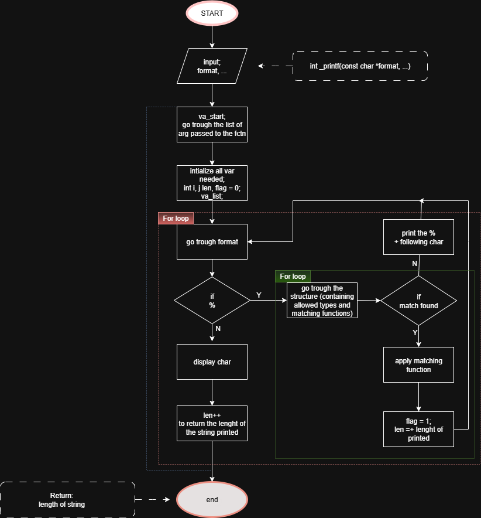

# **Project : _printf**

## Description

In this project we tried to reproduces the standart printf function.
The function receives a string passed as argument.
It associates it with a specific printing function, depending on the type of the arg passed, using a recognized specifier.
It can handle characters, strings, integers and binaries.
More types could later be added using the structure 'types'.


## GitHub Link

([GitHub Pages]())

## Features

%% : Print character -> %

%c : Print a character

%s : Print a string

%d / %i : Print an int and decimal

%b : Print an int translated in binary

## How to use
Test exemple:

    #include "main.h"
    /**
    * main - Entry point
    *
    * Return: Always 0
    */
    int main(void)
    {
        _printf("DNegative:[%d]\n", -762534);
        printf("DNegative:[%d]\n", -762534);
        _printf("Positive:[%d]\n", 762534);
        printf("Positive:[%d]\n", 762534);
        _printf("short pos:[%d]\n", 4);
        printf("short pos:[%d]\n", 4);
        _printf("Negative short:[%d]\n", -4);
        printf("Negative short:[%d]\n", -4);
        _printf("INegative:[%i]\n", -762534);
        printf("INegative:[%i]\n", -762534);
        _printf("Positive:[%i]\n", 762534);
        printf("Positive:[%i]\n", 762534);
        _printf("short pos:[%i]\n", 4);
        printf("short pos:[%i]\n", 4);
        _printf("Negative short:[%i]\n", -4);
        printf("Negative short:[%i]\n", -4);
        _printf("Character:[%c]\n", 'H');
        printf("Character:[%c]\n", 'H');
        _printf("just a simple string\n");
        printf("just a simple string\n");
        _printf("just a simple [%s]\n", "string");
        printf("just a simple [%s]\n", "string");
        _printf("Unknown:[%r]\n");
        printf("Unknown:[%r]\n");
        _printf("percent:[%%]\n");
        printf("percent:[%%]\n");
        _printf("int %i str %s\n", 34, "chaine");
        printf("int %i str %s\n", 34, "chaine");
        _printf("percent:[%%] [%%x] [%%i]\n", 23);
        printf("percent:[%%] [%%x] [%%i]\n", 23);
        _printf("binary : %b\n", 23);
        printf("binary : %b\n", 23);
        return (0);
    }

Compile using following command : 

```c
gcc -Wall -Werror -Wextra -pedantic -std=gnu89 -Wno-format _printf.c types_functions_strchar.c types_functions_int.c types_function_binary.c anexfunctions.c testint.c -o printf
```

## Structure of files
+ _printf.c                             //main function (printf function)
+ main.h                                //header
+ types_function_binary.c               //function to print in binary
+ types_functions_int.c                 //function to print an int
+ types_functions_strchar.c             //function to print a string, char and %%
+ anexfunctions.c                       //reproduction of the strlen standart function
+ .gitignore                            //file containing all the tests and executable files
+ README.md                             //explanation of the project

## Flowchart 



## The rules we followed

+ Edition was made on VS code.
+ A functional README is present, you are actually enjoying it atm.
+ The codebase follows the Betty coding style. Every file ends with a new line and most of the files have less than 40 lines. (but not all of them, sadly)
+ To improve readability of our files we put each different functions in a specific file.
+ No global variables were used.
+ All function prototypes can be viewed in the header file (main.h)
+ Appropriate include guards were implemented in all header files to prevent multiple inclusions.

## Authors
Sarah Wacquier
Christophe Saniez-Lenthieul
